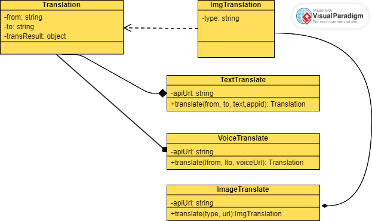

# 组件接口设计


## UML表达模型




关系：

1. TextTranslate、VoiceTranslate 和 ImageTranslate 都是翻译组件中的三个子组件，它们之间没有继承或依赖关系。这意味着它们的功能是相互独立的，可以在不需要其他组件的情况下单独使用。
2.  Translation 类表示翻译结果，其中包括源语言类型 from、目标语言类型 to 和翻译结果 transResult，而 ImgTranslation 类继承自 Translation 类，增加了图片类型 type 的属性。因此，ImgTranslation 是 Translation 类的子类，它继承了 Translation 类的所有属性，并且增加了一个新的属性。 
3. TextTranslate、VoiceTranslate 和 ImageTranslate 中的 translate 方法都返回一个 Translation 或 ImgTranslation 类型的对象，这意味着它们与 Translation 和 ImgTranslation 类之间有组合关系。具体来说，translate 方法构造并返回一个 Translation 或 ImgTranslation 类型的实例对象，从而将翻译结果传递给其他部分。 T
4. extTranslate、VoiceTranslate 和 ImageTranslate 中的 apiUrl 属性和它们的 translate 方法均使用 API 请求地址，这意味着这些类之间存在聚合关系。具体来说，这些类通过使用一个共同的 apiUrl 属性来表达它们之间的联系，同时它们的 translate 方法也使用该属性来发起 API 请求，以获取翻译结果。


## 组件接口具体解释


### TextTranslate

```
+------------------------+
|       TextTranslate    |
+------------------------+
| - apiUrl: string       |
|                        |
| + translate(from, to,  |
|text,appid): Translation|
+------------------------+
```

其中，TextTranslate 类包含一个私有属性 apiUrl，表示 API 请求地址。类中只有一个公有方法 translate，接收三个参数：源语言类型 from、目标语言类型 to 、需要翻译的文本内容 text和小程序的appid值，返回一个 Translation 类型的对象。

### VoiceTranslate

```
+------------------------+
|      VoiceTranslate    |
+------------------------+
| - apiUrl: string       |
|                        |
| + translate(lfrom, lto,|
|   voiceUrl): Translation|
+------------------------+
```

其中，VoiceTranslate 类包含一个私有属性 apiUrl，表示 API 请求地址。类中只有一个公有方法 translate，接收三个参数：源语言类型 lfrom、目标语言类型 lto 和待翻译语音的 URL 地址 voiceUrl，返回一个 Translation 类型的对象。

### ImageTranslate

```
+------------------------+
|      ImageTranslate    |
+------------------------+
| - apiUrl: string       |
|                        |
| + translate(type, url):|
|   ImgTranslation       |
+------------------------+
```

其中，ImageTranslate 类包含一个私有属性 apiUrl，表示 API 请求地址。类中只有一个公有方法 translate，接收两个参数：图片类型 type 和待翻译图片的 URL 地址 url，返回一个 ImgTranslation 类型的对象，该对象继承自 Translation 类，并增加了图片类型 type 的属性。

### Translation

```
+------------------------+
|      Translation       |
+------------------------+
| - from: string         |
| - to: string           |
| - transResult: object  |
+------------------------+
```

其中，Translation 类表示翻译结果，包括源语言类型 from、目标语言类型 to 和翻译结果 transResult。

### ImgTranslation

```
+------------------------+
|     ImgTranslation     |
+------------------------+
| extends Translation    |
+------------------------+
| - type: string         |
+------------------------+
```

其中，ImgTranslation 类继承自 Translation 类，增加了图片类型 type 的属性。
